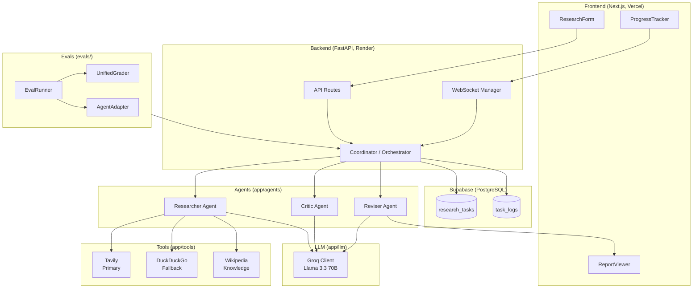

# SynapseAI

A self-correcting multi-agent research system that produces structured, cited reports from natural language queries.

Three specialized agents (Researcher, Critic, Reviser) collaborate in a feedback loop: the Researcher plans search strategies and drafts reports from live web data, the Critic scores the draft and identifies weaknesses, and the Reviser rewrites based on feedback. The cycle continues until a quality threshold is met.

---
## Architecture



**Backend**: FastAPI, Python 3.11, Groq LLM (Qwen 2.5 / Llama 3.3 70B), Supabase (PostgreSQL + JSONB)

**Frontend**: Next.js 16, React 19, Tailwind CSS v4, Framer Motion

**Infrastructure**: Docker, Render (backend), Vercel (frontend)

---

## How It Works

1. User submits a research topic via the frontend
2. Backend creates a task in Supabase, returns task ID immediately (HTTP 202)
3. Background workflow starts:
   - **Planning** — LLM generates 3-5 targeted search queries
   - **Gathering** — Tavily + Wikipedia run in parallel, results deduplicated
   - **Drafting** — LLM synthesizes sources into a structured report (Pydantic-validated JSON)
   - **Critiquing** — Critic agent scores the draft 0-10, lists weaknesses
   - **Revising** — Reviser agent rewrites based on feedback
4. Frontend tracks progress via WebSocket + HTTP polling
5. Final report rendered with citations

All LLM outputs are validated against Pydantic models using Groq's JSON mode, ensuring structured, parseable responses.

---

## Quick Start

### Prerequisites

- Python 3.11+
- Node.js 18+
- API keys: [Groq](https://console.groq.com/) (free), [Supabase](https://supabase.com/) (free tier), [Tavily](https://tavily.com/) (optional, free tier)

### Backend

```bash
cp .env.example .env
# Fill in GROQ_API_KEY, SUPABASE_URL, SUPABASE_KEY

python -m venv venv
venv\Scripts\activate        # Windows
pip install -r requirements.txt
uvicorn app.api.routes:app --reload
```

Backend runs at `http://localhost:8000`. API docs at `http://localhost:8000/docs`.

### Frontend

```bash
cd frontend
npm install
npm run dev
```

Frontend runs at `http://localhost:3000`.

### Docker (Backend Only)

```bash
docker build -t synapseai-backend .
docker run -p 8000:8000 --env-file .env synapseai-backend
```

---

## Database Setup

Run `supabase_schema_fixed.sql` in your Supabase SQL Editor. This creates:

- `research_tasks` — Main state table (JSONB document store pattern)
- `task_logs` — Agent message audit trail (separate to avoid bloat)

---

## Evaluation Framework

The `/evals` route provides a benchmarking dashboard. Test cases in `eval_cases.json` are run through the agent pipeline and graded on four dimensions:

- **Content Quality** — Depth and relevance
- **Source Citation** — Accuracy and frequency
- **Reasoning Quality** — Logical coherence
- **Tool Usage** — Effective use of search tools

Results are visualized in the frontend at `/evals`.

---

## Project Structure

```
├── app/
│   ├── agents/          # Researcher, Critic, Reviser agents
│   ├── api/             # FastAPI routes + eval endpoints
│   ├── database/        # Supabase connection manager
│   ├── llm/             # Groq client with structured JSON output
│   ├── models/          # Pydantic models (the data contract)
│   ├── orchestrator/    # Coordinator state machine
│   └── tools/           # Web search (Tavily/DDG) + Wikipedia
├── evals/               # Evaluation runner, graders, types
├── frontend/            # Next.js 16 app
│   └── src/
│       ├── app/         # Pages (home, research/[taskId], evals)
│       ├── components/  # ResearchForm, ProgressTracker, ReportViewer
│       └── lib/         # API client, types
├── Dockerfile
├── supabase_schema_fixed.sql
└── eval_cases.json
```

---

## Tech Decisions

| Choice | Reasoning |
|--------|-----------|
| Groq over OpenAI | Sub-second inference for 70B models. 4-6 LLM calls per request — latency compounds. |
| JSONB document store | Entire task state in one row. Avoids complex joins for write-heavy, read-once workload. |
| Pydantic for LLM output | `model_validate_json()` enforces schema on every LLM response. No format hallucinations reach the user. |
| Background tasks | HTTP 202 pattern — user gets instant response, research runs async. |
| Separate logs table | Agent logs can grow to megabytes. Keeping them out of the main task row avoids bloated reads. |
